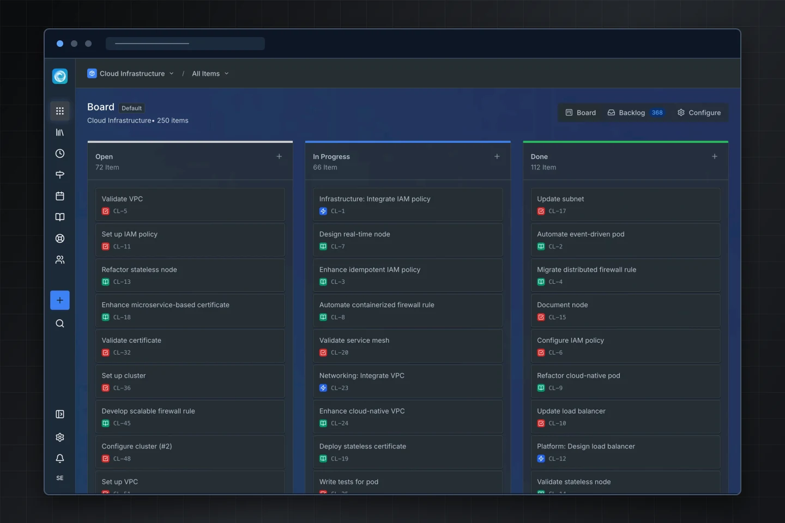

  <picture>
    <source media="(prefers-color-scheme: light)" srcset=".github/assets/readme-splash.svg">
    
  </picture>

  
  
  
  

 <strong>Work management that fits the way your team works.</strong>  Plan projects, organize your work, and keep things moving, while keeping your data under your control. 

  <picture>
    <source media="(prefers-color-scheme: light)" srcset=".github/assets/screenshots/hero-board-framed.webp">
    
  </picture>

## One place for the work that matters

Windshift brings planning, tracking, and collaboration into a fast, flexible workspace. Start with a simple kanban board, then add the structure your team needs: custom workflows, nested work items, milestones, saved searches, dashboards, and more.

It ships as a single Go binary with the Svelte frontend built in. 

## Highlights

- Plan work your way - move between boards, backlogs, hierarchy views, milestones, iterations, and dashboards as your work evolves.
- Customize the workflow around your team - configure item types, statuses, fields, screens, priorities, and recurring work.
- Keep context - add rich descriptions, comments, mentions, attachments, collections, and knowledge pages.
- Bring customers into the system - share public boards and accept external requests through a customer portal.
- Connect the tools you already use - integrate GitHub, Gitea, and Forgejo, import Jira projects, and send email or webhook notifications.
- Add the capabilities you need - extend work management with test management, time tracking, or asset management.

## Get started

[Download the latest release](https://windshift.sh/download), then follow the [quick start guide](https://windshift.sh/self-hosting/01-getting-started/02-quick-start). Windshift is designed to run comfortably on anything from a Raspberry Pi to a dedicated server.

Want to build from source? See [BUILD.md](BUILD.md). For local development and contribution guidelines, see [CONTRIBUTING.md](CONTRIBUTING.md).

## Contributing

Code contributions, bug reports, and feedback are all welcome here on GitHub. Open pull requests against `main`; use GitHub Issues and Discussions for bug reports and feedback.

We are especially interested in early bug reports and real-world feedback about OIDC providers.

## Tech stack

- Backend: Go
- Frontend: Svelte, Vite, and Tailwind CSS
- Database: SQLite by default, with PostgreSQL support

## Documentation

- [Build instructions](BUILD.md)
- [Contributing guide](CONTRIBUTING.md)
- [Logging configuration](LOGGING.md)
- [Product documentation](https://windshift.sh/docs)

## License

Windshift is available under the [GNU Affero General Public License v3.0](LICENSE).
